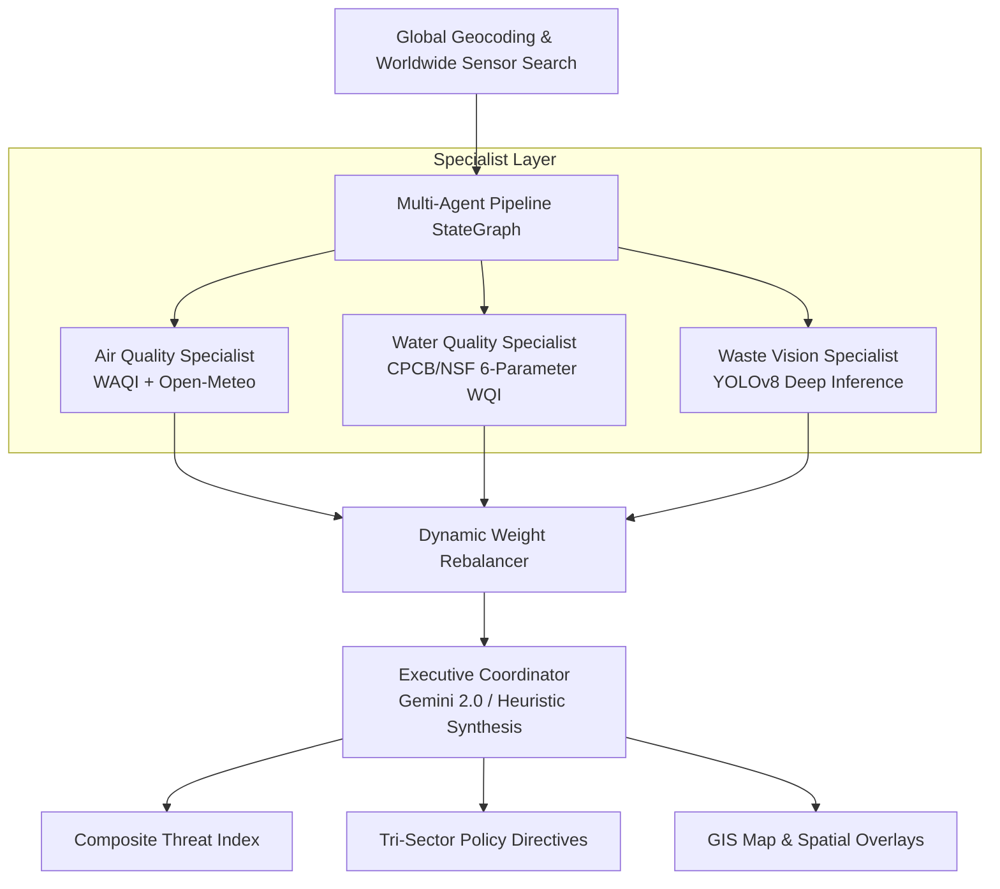

# EcoMesh — Autonomous Environmental Multi-Agent Risk Intelligence

[](https://www.python.org/downloads/)
[](https://fastapi.tiangolo.com)
[](https://langchain-ai.github.io/langgraph/)
[](https://github.com/ultralytics/ultralytics)
[](https://ai.google.dev/)
[]()

> **An Autonomous Environmental Decision Support System** integrating Atmospheric Telemetry, Aquatic WQI Analytics, YOLOv8 Optical Waste Detection, and Dynamic Fault-Tolerant Multi-Agent Consensus.

---

## 🌟 Key Highlights & Capabilities

- 🌍 **Worldwide Dynamic Telemetry**: Real-time atmospheric and air quality monitoring across any city or territory globally using live **WAQI APIs** and zero-downtime **Open-Meteo Global Geocoding & Air Quality APIs**.
- 🤖 **Multi-Agent StateGraph Architecture**: Built with **LangGraph**, orchestrating independent specialist sensory nodes (Air, Water, Waste) with an autonomous Executive Coordinator.
- ⚖️ **Dynamic Fault-Tolerant Weight Redistribution**: When a sensor probe experiences an outage or telemetry becomes stale, the coordinator dynamically recalculates risk weights to eliminate false alarms and preserve signal integrity.
- 👁️ **YOLOv8 Computer Vision Studio**: Edge-ready optical litter detection model classifying debris density and bounding boxes from municipal camera feeds.
- 🏛️ **Tri-Sector Actionable Policy Directives**: Generates targeted directives for Municipal Corporations, Public Health Authorities, and Citizens.
- 🎨 **Modern SaaS Interface**: Clean, accessible, light-themed responsive dashboard built with standard HTML5, CSS3, JavaScript, Leaflet GIS mapping, and Lucide icons.

---

## 📐 System Architecture



---

## 📁 Repository Structure

```
ecomesh/
├── agents/                      # Specialist and Coordinator agent definitions
│   ├── base.py                  # Pydantic v2 typed SignalReport & CoordinatorVerdict schemas
│   ├── air_agent.py             # Atmospheric Air specialist (WAQI + Open-Meteo)
│   ├── water_agent.py           # Hydrological Catchment CCME WQI specialist
│   ├── waste_agent.py           # Optical Computer Vision YOLOv8 specialist
│   ├── health_agent.py          # Epidemiological Clinical Surge risk specialist
│   ├── policy_agent.py          # Municipal Logistics & Statutory Trigger specialist
│   └── coordinator.py           # Consensus Arbiter, weight rebalancer & negotiation engine
├── graph/                       # LangGraph workflow orchestration
│   └── workflow.py              # StateGraph compiled 6-step sequential pipeline
├── services/                    # Core sensory integrations & computation
│   ├── aqi_client.py            # Global geocoding & WAQI/Open-Meteo REST client
│   ├── wqi.py                   # Canadian CCME 6-parameter Water Quality Index calculator
│   ├── vision.py                # YOLOv8n inference pipeline for waste & debris detection
│   ├── gemini_engine.py         # Autonomous synthesis & directive generation
│   └── narrative.py             # Executive briefing & cross-domain analysis service
├── frontend/                    # Modern Enterprise SaaS Web Application
│   ├── index.html               # Semantic 7-page workspace layout & 3-tier enterprise nav
│   ├── style.css                # Polished design system tokens, typography & components
│   └── app.js                   # Client routing, Leaflet GIS, Chart.js & YOLOv8 camera studio
├── tests/                       # Automated Pytest Suite
│   └── test_agents.py           # Comprehensive unit & integration test coverage (9/9 passing)
├── .env.example                 # Environment configuration template
├── .gitignore                   # Version control exclusion rules
├── requirements.txt             # Python package dependencies
├── server.py                    # Production FastAPI server & REST endpoints
└── README.md                    # System architecture documentation
```

---

## 🚀 Quickstart & Installation

### 1. Clone the Repository
```bash
git clone https://github.com/Prime4045/ecomesh.git
cd ecomesh
```

### 2. Create and Activate a Virtual Environment
```bash
# Windows
python -m venv venv
venv\Scripts\activate

# macOS / Linux
python3 -m venv venv
source venv/bin/activate
```

### 3. Install Dependencies
```bash
pip install -r requirements.txt
```

### 4. Configure Environment Variables
Copy `.env.example` to `.env`:
```bash
cp .env.example .env
```
Edit `.env` and insert your API credentials:
```env
WAQI_API_TOKEN=your_waqi_api_token_here
GEMINI_API_KEY=your_gemini_api_key_here
```
*(Note: If no Gemini key is provided, the platform operates autonomously using deterministic heuristic synthesis).*

---

## 🖥️ Running the Application

Launch the FastAPI server:
```bash
python server.py
```
Open your browser and navigate to:
👉 **`http://localhost:8000`**

---

## 🧪 Running Automated Tests

Run the full automated test suite using `pytest`:
```bash
pytest
```

---

## 🛡️ License

This project is licensed under the MIT License — see the [LICENSE](LICENSE) file for details.
